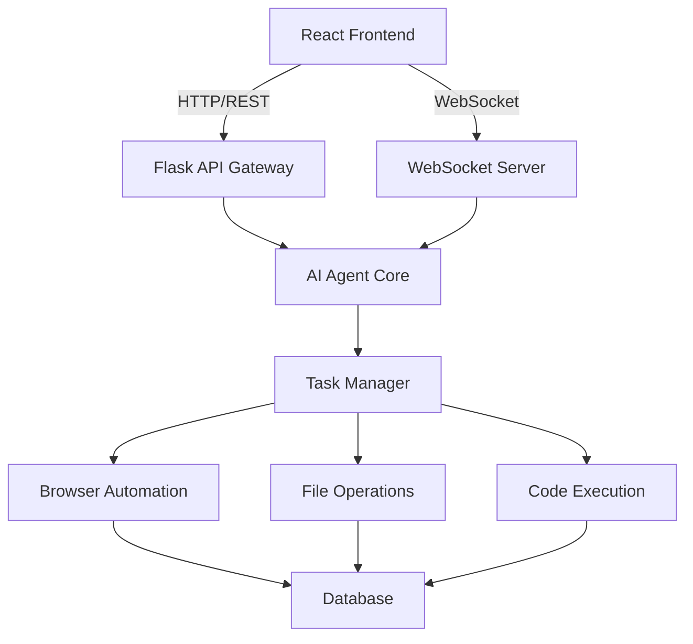
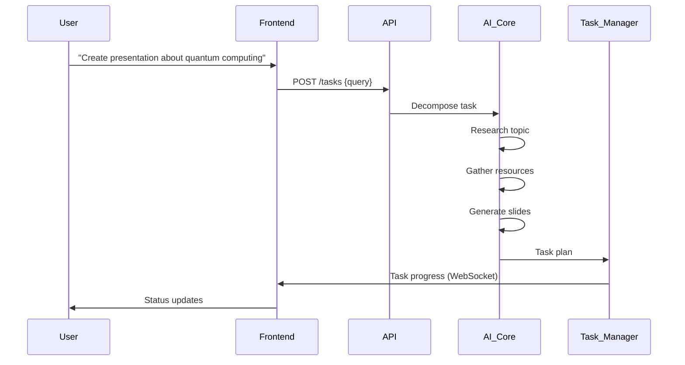
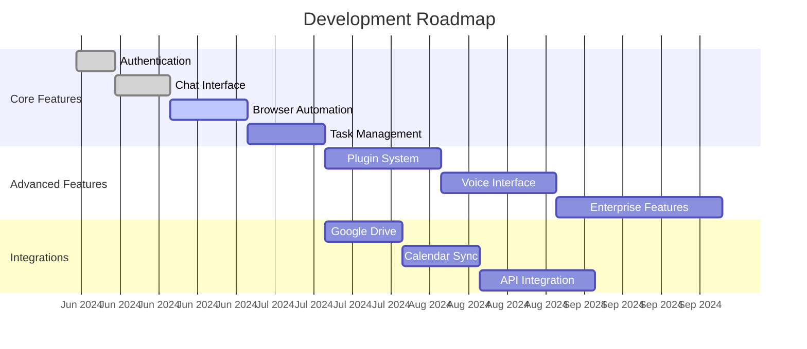

# Manus Mini - AI-Powered Task Automation Platform


## Introduction
Manus Mini is an open-source alternative to proprietary AI task automation platforms, combining **conversational AI**, **browser automation**, and **workflow orchestration** in a single application. This lightweight solution empowers developers to automate complex tasks through natural language commands.

[](https://github.com/likhonsheikh54/Manus-Mini)
[](https://opensource.org/licenses/MIT)
[](https://www.python.org/)
[](https://reactjs.org/)

## Key Features

### 🗨️ Conversational Task Execution
- Natural language processing with Google Gemini
- Real-time chat interface with message history
- File attachment support for context-aware processing
- Typing indicators and message status tracking

### 🌐 Intelligent Browser Automation
- Embedded browser viewport with Playwright
- Screenshot capture at critical steps
- Action logging with timestamps
- User intervention capabilities

### 📊 Workflow Orchestration
- Visual task progress tracking
- Pause/resume/cancel functionality
- Task history and analytics
- Predefined templates for common workflows

### 🚀 Technical Highlights
- Containerized execution environment (Docker)
- Secure code sandboxing
- Real-time updates via WebSockets
- Extensible plugin architecture

## Technical Architecture

### System Overview


### Component Interaction


### Data Flow


### Component Hierarchy
```jsx
function App() {
  return (
    <div className="app-container">
      <Header />
      <MainLayout>
        <ChatPanel messages={messages} onSend={handleSend} />
        <BrowserView url={currentUrl} screenshot={screenshot} />
        <TaskPanel tasks={tasks} onTaskAction={handleTaskAction} />
      </MainLayout>
      <StatusBar connectionStatus={wsStatus} />
    </div>
  );
}
```

## Getting Started

### Prerequisites
- Python 3.9+
- Node.js 18+
- Docker 20.10+
- Playwright browsers (`npx playwright install`)

### Installation
```bash
# Clone repository
git clone https://github.com/likhonsheikh54/Manus-Mini.git
cd Manus-Mini

# Install backend dependencies
python -m venv venv
source venv/bin/activate
pip install -r requirements.txt

# Install frontend dependencies
cd frontend
npm install

# Set up environment variables
cp .env.example .env
# Edit .env with your Google Gemini API key
```

### Running the Application
```bash
# Start database and message broker
docker-compose up -d

# Start backend services
python app.py

# In another terminal, start frontend development server
cd frontend
npm start
```

### Production Deployment
```bash
# Build Docker containers
docker-compose -f docker-compose.prod.yml build

# Start production services
docker-compose -f docker-compose.prod.yml up -d
```

## User Interface

### Desktop Layout


The desktop interface features:
1. **Three-panel layout** for simultaneous task management
2. **Resizable panels** for customized workflows
3. **Real-time task progress** visualization
4. **Interactive browser viewport** with navigation controls

### Mobile Layout


Mobile-optimized interface includes:
1. **Tab navigation** for efficient screen space usage
2. **Gesture-based controls** for browser interactions
3. **Context-aware task panels** that adapt to workflow stages
4. **Offline capability** for task queuing

## Core Functionality Deep Dive

### AI Task Processing Pipeline


### Browser Automation Workflow
```python
def automate_browser(task):
    with sync_playwright() as p:
        browser = p.chromium.launch()
        page = browser.new_page()
        
        for step in task.steps:
            if step.action == "navigate":
                page.goto(step.url)
                page.screenshot(path=f"step_{step.order}.png")
            elif step.action == "extract":
                content = page.query_selector(step.selector).inner_text()
                task.add_result(content)
            
            # Send real-time update
            ws_server.broadcast({
                "type": "browser_update",
                "step": step.order,
                "screenshot": f"step_{step.order}.png"
            })
        
        browser.close()
```

## Roadmap

### Next Features
- [ ] PDF generation module
- [ ] Calendar integration
- [ ] Voice command interface
- [ ] Multi-agent collaboration
- [ ] Plugin system for custom tools

### Development Timeline


## Contributing
We welcome contributions! Please follow these steps:
1. Fork the repository
2. Create your feature branch (`git checkout -b feature/your-feature`)
3. Commit your changes (`git commit -m 'Add some feature'`)
4. Push to the branch (`git push origin feature/your-feature`)
5. Open a pull request

### Development Guidelines
- Follow PEP 8 for Python code
- Use React functional components with hooks
- Document new features with MDX examples
- Include unit tests for critical functionality
- Maintain 90%+ code coverage

## License
Distributed under the MIT License. See `LICENSE` for more information.

## Connect
[](https://github.com/likhonsheikh54/Manus-Mini)
[](https://twitter.com/likhonsheikh)
[](https://linkedin.com/in/likhonsheikh)
[](https://discord.gg/manus-mini)

---
"Automation is not about replacing humans; it's about amplifying human potential." - Likhon Sheikh
